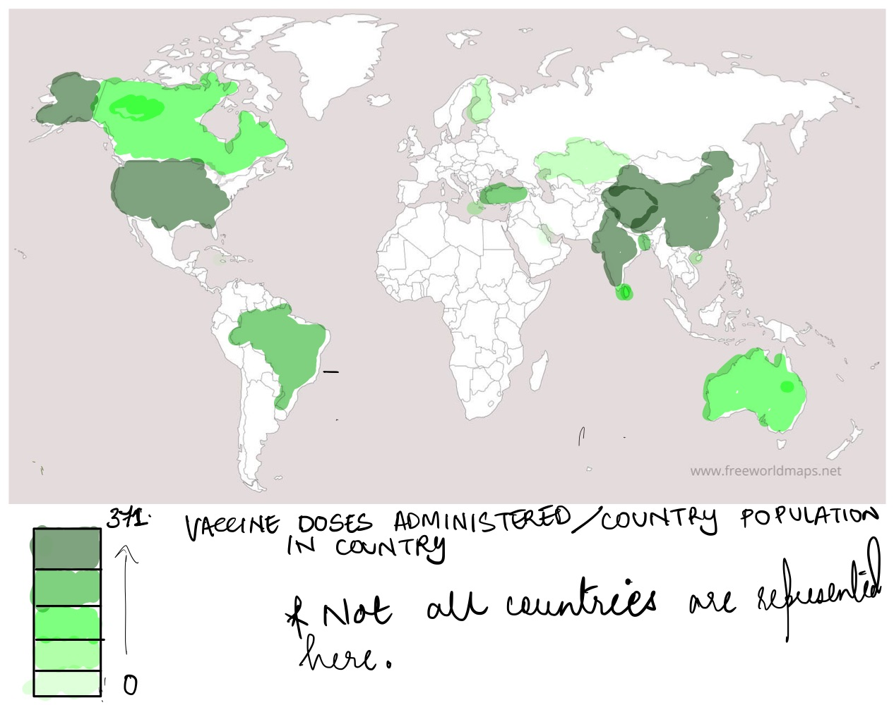

# Step 1) Select a Visualization 

<iframe src="https://ourworldindata.org/grapher/cumulative-covid-19-vaccinations-vs-population" loading="lazy" style="width: 100%; height: 600px; border: 0px none;"></iframe>

# Step 2) Data Visualization Critique

 Record of responses for Data Visualization Effectiveness Profile:  
 As a viewer I do believe the graph is relevant. Any graph that is accurate and is related to the pandemic in the last two years is of high usefulness. The  completeness of the graph is debatable, because I don't understand why the given set of countries are chosen in particular. I can make an assumption that the graph wants to represent countries from every population range, but then this is not intuitive. 
 What worked well for the graph is that the user is easily understand what is trying to be mapped - Population VS Cumulative Vaccinations  Doses Administered , the presence of the legend is helpful to interpret the continents that have the most number of vaccinations administered.
The Graph is interactive; we can click on a single data point to isolate it (greying out other points)  and do get it X and Y axis values of that particular point
 The presence of the dotted lines representing the COVID doses makes the chart crowded and doesn't contribute to the Perceptibility and Aesthetic of the graph.
I would remove the the dotted lines representing the kind of doses of the vaccine. All the this in added information about where each country stands with regard to COVID doses, it doesn't really add to the aesthetic and perceptibility of the visual.
 

# Step 3) Wireframe Solutions
Since the data contains countrywise data and associated metrics I thought that the data could be best visualized using a of heat map of the world. The datasource provides the total number of COVID cases per country and the country's population. This data can be used for any comparision chart.
The per capita cumulative covid cases for a country can than be compared.

# Step 4) Test Solution

Answering the following the questions of the visualization

- Can you tell me what you think this is?

- Can you describe to me what this is telling you?

- Is there anything you find surprising or confusing?

- Who do you think is the intended audience for this?

- Is there anything you would change or do differently?

Participant 1:
 - A1 The first impression of it that it is a heat map. 
 - A2 It represents the number of vaccine doeses adimistered per country and there is some sort of comparision between countries.
 - A3 I don't know what the units of the values used to create the visual are. 
 - A4 The intended audience of the graph are researchers, people interested in the COVID vaccine. 
 - A5 List the countries on the graph/ or pop-up. The title of the graph needs to be more clear and descriptive. 

Participant 2:
- A1 The first impression of it that it is map measuring the severity of an issue
- A2 The map is comparing countries based on the number of doses of the COVID Vaccine administered
- A3 The legend needs to be clearer with what is being measured.
- A4 The intended audience of the graph are people who are tracking daily COVID cases
- A5 Clearer context to the graph, better title

Both participants got the idea that the graph was representing a comparision between countries related to the COVID vaccine administration. The wireframe fell short to clearly explaining what the visual intented to do from the title.

# Step 5) Build Solution:

 Link to Redesigned Visualization: 
 https://public.tableau.com/views/RedesignedDataVisualization/Sheet1?:language=en-US&publish=yes&:display_count=n&:origin=viz_share_link 

 I used Tableau to create a visualization to represent the number of vaccinations per capita for a country. The countireswere differentiaited based on high the per capita metric was. The color palette chosen was a green gradient as a COVID vaccine represents something positive. 

